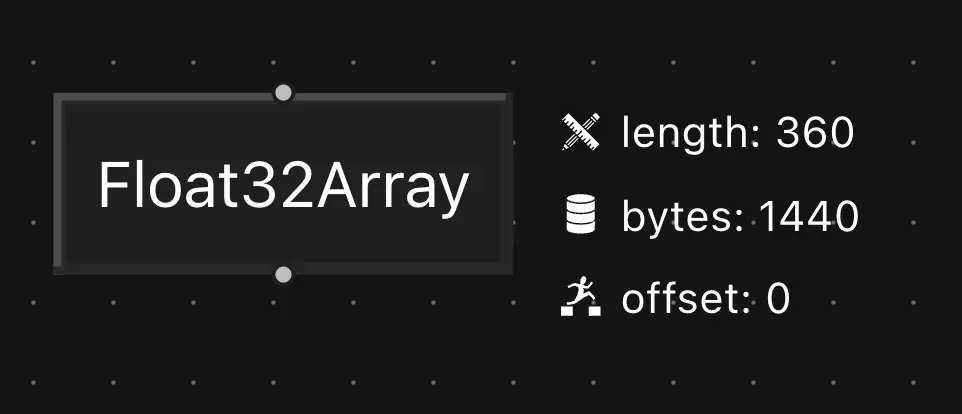
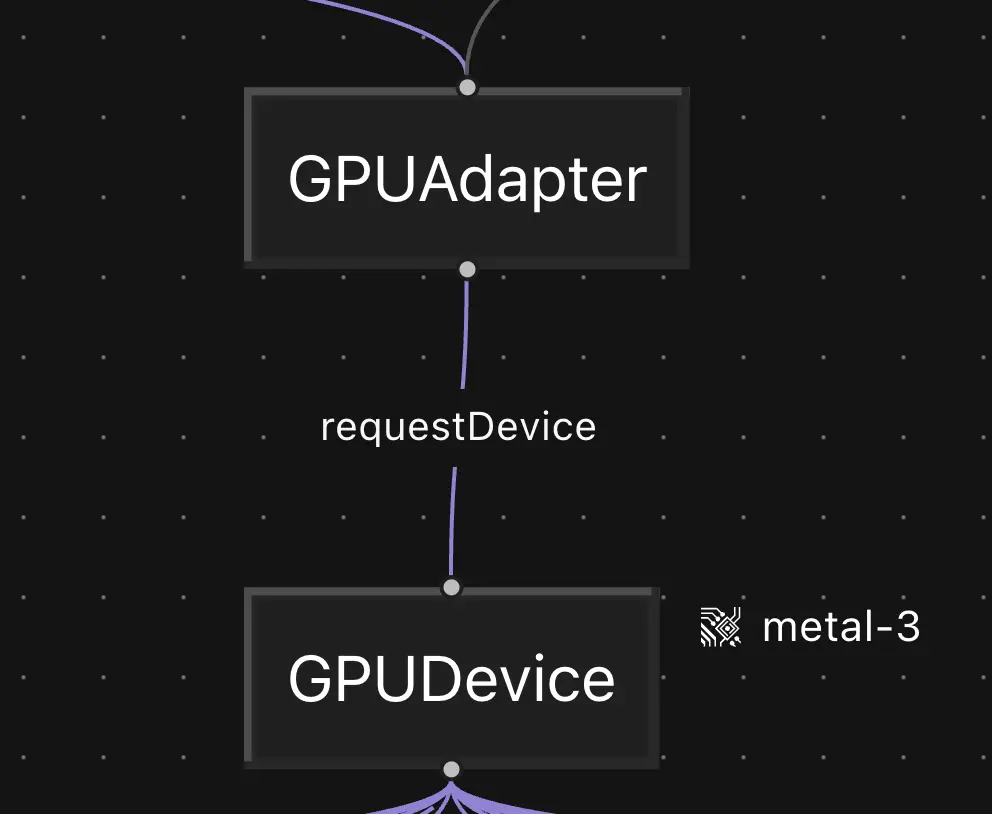
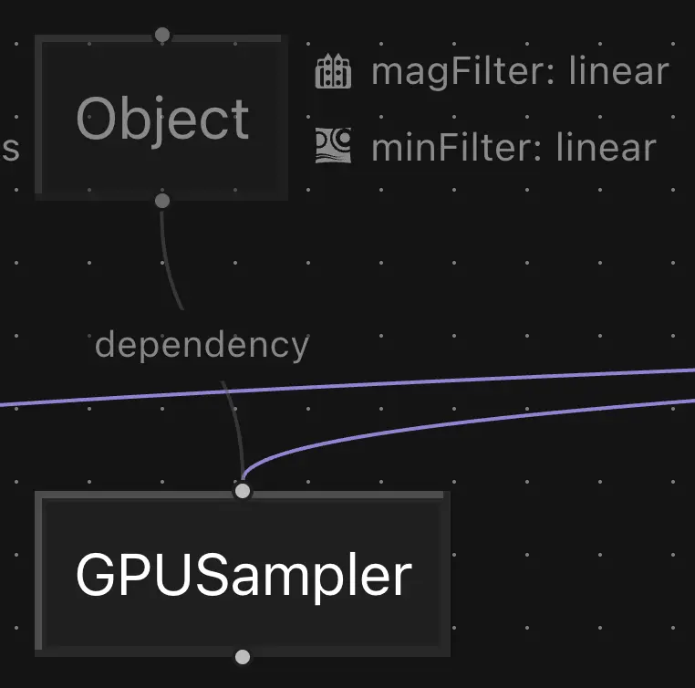
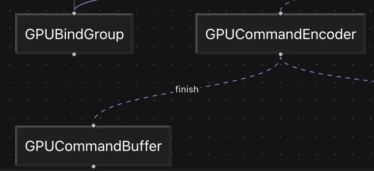

#  Jacket - WebGPU Execution Visualizer

Jacket is a graph-based visualizer for the execution of WebGPU code.

It is a static, offline-capable web app which watches your local code folder, runs your WebGPU code and shows you in realtime what it's doing.

> Jacket makes use of newish (for mid-2025) Web APIs. As such it will only work on recent browsers such as Chrome stable and soon Firefox stable.

## What can it do?

- Show you WebGPU objects such as buffers, pipelines, encoders. Basically any of the classes named `GPUxxx` in Javascript
- Show object relationships, principally 'produced-by' such as `GPUDevice -> GPUCommandEncoder`, and 'used-by' e.g. `GPUBuffer -> GPUBindGroup`
- Give the class-specific status/details of objects like whether a `GPUBuffer` is mapped or unmapped
- Do it all in realtime
- Auto-reload your local code
- Be used entirely offline. It won't send your code anywhere and uses a service worker to cache itself after first load

## Start Visualizing

Visit the [hosted version](https://rosofo.github.io/jacket), click the 'path' button to load up a folder. The folder should minimally contain a `main.js` module which exports `program(params) {...}`. 

The `params` object contains:

- proxied versions of the `navigator` and `HTMLCanvasElement`
- a `files` record with name and text of any other files found in the folder. So for example if you have `main.js` and next to it a `fragment.wgsl`, your code would access that via `params.files['fragment.wgsl']`

In this function you can write your setup code, and then return a `Promise<() => void>` containing your per-frame code.

> If you prefer to use a bundler and external dependencies that's fine, you can point Jacket at your build folder and it should be happy!
>
> See `examples/` for one way to set that up.

## Run it locally

Just clone this repo and run `npm i` then `npm run dev` or `npm run build; npm run preview`

## Interpreting the UI

### Graph

Values produced by your code are represented as nodes. To the right of the node will be the values of relevant properties/object state:

A method call is represented by a 🔹 blue edge running from the parent object to the returned value:

Arguments to method calls are connected with a 🩶 grey 'dependency' edge to the value which required them:

Finally any kind of edge can be either solid or dashed (animated). A dashed edge indicates that the target was created as part of per-frame rendering:

## Under the hood

Jacket can be boiled down to a pipeline with the following components:

- A folder watcher which uses the [File System API](https://developer.mozilla.org/en-US/docs/Web/API/File_System_API) to gain continuous access to a local folder. The handle is saved in IndexedDB and reused on page reload.
- An executor which takes the code, turns it into a JS module and calls `module.program` with the parameters. The `navigator` and canvas are wrapped in a Proxy which is able to track method calls, produced values, etc. The tracked values are given IDs and have their relationships encoded using those IDs. Everything gets stored in a flat array for further processing.
- The visualizer, which turns the flat array into a graph, does some pruning to get rid of nulls and primitives and displays it all in a [React Flow](https://reactflow.dev/) component.

### Tracking Values

As the user's code runs, it produces values of arbitrary kinds, passes them around and consumes them. Jacket's job is to observe this process and visualize it, hopefully without requiring too many changes by the user. There are many possible options for programmatically observing code without prior knowledge but a popular one makes use of a [Proxy](developer.mozilla.org/en-US/docs/Web/JavaScript/Reference/Global_Objects/Proxy) which wraps the underlying values. Proxies are great because they can be made transparent to the user's code while allowing us to hook into property access. They're also tricky to use and can lead to many subtle bugs. If you use vanilla Proxies be assured you will meet all the seediest 'features' of Javascript.

> An option not explored here is static analysis, i.e. parsing the source without running it and trying to infer something about its semantics. Jacket doesn't do this because it's hard and we can avoid it for our use-case.

Anyway, after the initial bug squashing, our proxies look like this:

- We wrap a pre-existing `HTMLCanvasElement` and the built-in `navigator` in our proxy
- The proxies are passed to the user's code
- Wherever a proxy's properties are accessed, we track the event, then take the underlying values and wrap *those* in a proxy too. The same happens with the results of method calls and promises. Examples:
  - `navigator.gpu`
    - **logs** a property access
    - **evaluates** to `Proxy(GPU)`
  - `gpu.requestAdapter(...)`
    - **logs** a property access, a method call and a promise resolution
    - **evaluates** to a promise which resolves to `Proxy(GPUAdapter)`
- The proxies spread out tree-like, wrapping buffers, pipelines, encoders, etc

## Todos

- Expose more information
- Improve performance & stability

## Thanks

[mini](https://github.com/mini-ninja-64) for her awesome library `proxify` (should see a proper release soonTM)
